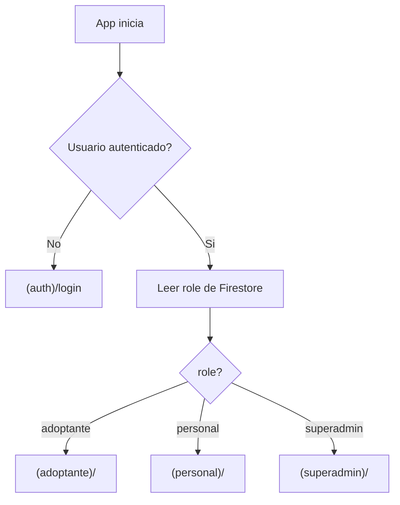

## Comparacion de planes generados

Se generaron 3 planes independientes. Los tres coinciden en:
- Usar expo-router con Route Groups en lugar de navegadores personalizados en `src/navigation/`
- Usar `.ts`/`.tsx` (no `.js`/`.jsx`) por consistencia con el `tsconfig.json` existente
- Requerir `expo-dev-client` desde el inicio por incompatibilidad de `@react-native-firebase/messaging` con Expo Go
- Configurar Firebase completamente antes de escribir codigo
- Proxear la API de Gemini exclusivamente a traves de Cloud Functions

**Diferencias clave:**
| Aspecto | Plan 1 | Plan 2 | Plan 3 |
|---|---|---|---|
| Detalle de Firebase rules | Reglas completas con `getRole()` | Reglas + estrategia de indices | Solo mencion general |
| Config de entorno | `app.json` con `.env` | Migrar a `app.config.ts` | `app.json` directo |
| Ambientes | Un solo proyecto Firebase | Dev + Prod separados | Un solo proyecto |
| Esquemas Yup | Reglas campo por campo | Solo archivos listados | Solo archivos listados |
| Animaciones | Hook `useReducedMotion` + config centralizada | Mencion general | Solo mencion |

**Recomendacion:** Adoptar Plan 1 como base por su nivel de detalle, incorporando de Plan 2 la migracion a `app.config.ts` (necesaria para leer `.env` dinamicamente en Expo). Se descarta la separacion dev/prod de Firebase por ahora para simplificar el arranque.

**Riesgo importante:** `axios@1.15.1` podria no existir como version publicada en npm (la ultima estable es ~1.7.x). Si la instalacion falla, se necesitara confirmacion para usar la version mas cercana disponible.

---

## Fase 0 — Configuracion manual de Firebase y servicios externos

> Esta fase es enteramente manual. No se genera codigo.

### 0.1 Crear proyecto en Firebase Console
1. Ir a [Firebase Console](https://console.firebase.google.com/)
2. Crear proyecto: **"fundacion-huellitas"**
3. Deshabilitar Google Analytics (opcional, no se usa en la app)

### 0.2 Habilitar servicios en Firebase
| Servicio | Configuracion |
|---|---|
| **Authentication** | Habilitar proveedor "Correo electronico/contrasena" |
| **Cloud Firestore** | Crear base de datos en **modo produccion**, region `southamerica-east1` |
| **Storage** | Iniciar en modo produccion, misma region |
| **Cloud Functions** | Requiere plan **Blaze** (pago por uso). Activar facturacion |
| **Cloud Messaging** | Se activa automaticamente con el proyecto |

### 0.3 Registrar apps nativas
- **Android:** Registrar con package `com.fundacionhuellitas.app` → descargar `google-services.json` → colocar en la raiz del proyecto
- **iOS:** Registrar con bundle ID `com.fundacionhuellitas.app` → descargar `GoogleService-Info.plist` → colocar en la raiz del proyecto

### 0.4 Crear superadmin manualmente
1. En Firebase Auth Console → crear usuario con email/contrasena
2. Copiar el UID generado
3. En Firestore → coleccion `users` → crear documento con ID = UID:
```json
{
  "email": "admin@huellitas.org",
  "nombre": "Administrador",
  "role": "superadmin",
  "creadoEn": "<timestamp>"
}
```

### 0.5 Habilitar Google Maps API
1. Ir a [Google Cloud Console](https://console.cloud.google.com/) (mismo proyecto vinculado a Firebase)
2. Habilitar: **Maps SDK for Android** y **Maps SDK for iOS**
3. Crear clave de API → restringirla a las apps registradas
4. Guardar como `GOOGLE_MAPS_API_KEY` en `.env`

### 0.6 Obtener clave de Gemini API
1. Ir a [Google AI Studio](https://aistudio.google.com/)
2. Generar API key para el modelo Imagen 3
3. Guardar **exclusivamente** en `functions/.env` como `GEMINI_API_KEY` — nunca en el `.env` del cliente

### 0.7 Archivo `.env` del cliente
```
GOOGLE_MAPS_API_KEY=<tu-clave>
CLOUD_FUNCTIONS_URL=<url-base-de-functions>
```

### 0.8 Archivo `functions/.env`
```
GEMINI_API_KEY=<tu-clave>
```

### 0.9 Actualizar `.gitignore`
Agregar:
```
.env
google-services.json
GoogleService-Info.plist
functions/node_modules
functions/.env
```

---

## Fase 1 — Instalacion de dependencias y scaffolding

### 1.1 Instalar dependencias
```powershell
npx expo install @react-native-firebase/app @react-native-firebase/auth @react-native-firebase/firestore @react-native-firebase/storage @react-native-firebase/messaging expo-dev-client react-native-maps expo-location expo-image-picker

npm install react-hook-form @hookform/resolvers yup axios@1.15.1
```

### 1.2 Inicializar Cloud Functions
```powershell
npm install -g firebase-tools
firebase login
firebase init functions
```
Seleccionar TypeScript, instalar dependencias.

### 1.3 Migrar `app.json` a `app.config.ts`
Necesario para leer variables de `.env` dinamicamente. El archivo resultante incluira:
- Plugins de Firebase (`@react-native-firebase/app`)
- Plugin de `react-native-maps` con `GOOGLE_MAPS_API_KEY`
- Plugin de `expo-location` y `expo-image-picker` con descripciones en espanol
- `android.package`: `com.fundacionhuellitas.app`
- `ios.bundleIdentifier`: `com.fundacionhuellitas.app`

### 1.4 Ajustar `tsconfig.json`
Agregar alias `@/src/*` para la carpeta `src/`:
```json
{
  "compilerOptions": {
    "paths": {
      "@/*": ["./*"],
      "@src/*": ["./src/*"]
    }
  }
}
```

### 1.5 Eliminar archivos de template
**Eliminar:**
- `app/(tabs)/_layout.tsx`, `index.tsx`, `explore.tsx`
- `app/modal.tsx`
- `components/hello-wave.tsx`, `parallax-scroll-view.tsx`, `external-link.tsx`, `haptic-tab.tsx`
- `components/ui/collapsible.tsx`, `icon-symbol.tsx`, `icon-symbol.ios.tsx`
- `scripts/reset-project.js`
- `assets/images/partial-react-logo.png`, `react-logo*.png`

**Mantener y modificar:**
- `components/themed-text.tsx`, `components/themed-view.tsx` (actualizar paleta)
- `hooks/use-color-scheme.ts`, `hooks/use-theme-color.ts` (mantener interfaz, actualizar valores)

### 1.6 Crear estructura de carpetas
```
src/
  theme/
    colors.ts
    spacing.ts
    typography.ts
    animations.ts
  modules/
    adopcion/
      screens/
      components/
      hooks/
      services/
      schemas/
    mascotas/
      screens/
      components/
      hooks/
      services/
      schemas/
    ia-generativa/
      screens/
      components/
      hooks/
      services/
    superadmin/
      screens/
      components/
      hooks/
      services/
  shared/
    components/
    hooks/
    utils/
    types/
    services/
      firebase/
      gemini/
      notifications/
functions/
  src/
```

---

## Fase 2 — Theme, servicios Firebase y tipos compartidos

### 2.1 Archivos de tema

**`src/theme/colors.ts`** — unica fuente de verdad para colores:
```ts
export const Colors = {
  primary: '#1F3A56',
  secondary: '#4CAF96',
  accent: '#F58A3D',
  background: '#F4E6D2',
  neutralMid: '#A88F79',
  neutralLight: '#F2F4F7',
  textPrimary: '#0F1F2E',
  textSecondary: '#6B7C87',
  error: '#E53935',
  white: '#FFFFFF',
} as const;
```

**`src/theme/spacing.ts`** — escala de espaciado  
**`src/theme/typography.ts`** — tamanos de fuente y pesos  
**`src/theme/animations.ts`** — configuraciones de Reanimated con `useReducedMotion()`

### 2.2 Tipos compartidos — `src/shared/types/`

```ts
// models.ts
type Role = 'superadmin' | 'personal' | 'adoptante';
type Especie = 'perro' | 'gato' | 'otro';
type EstadoAnimal = 'disponible' | 'en_proceso' | 'adoptado';
type EstadoSolicitud = 'pendiente' | 'en_revision' | 'entrevista_agendada' | 'aprobada' | 'rechazada';
type EstadoEntrevista = 'programada' | 'completada' | 'cancelada';
type TipoReporte = 'perdido' | 'encontrado';
type EstadoReporte = 'activo' | 'resuelto';

interface User { uid: string; email: string; nombre: string; role: Role; telefono?: string; direccion?: string; fcmToken?: string; }
interface Animal { id: string; nombre: string; especie: Especie; raza: string; edad: number; sexo: string; tamano: string; descripcion: string; estadoSalud: string; fotos: string[]; estado: EstadoAnimal; ubicacion: string; creadoPor: string; creadoEn: Timestamp; }
interface Solicitud { id: string; animalId: string; adoptanteId: string; cedula: string; contacto: string; solvenciaEconomica: boolean; espacioDisponible: boolean; acuerdoFamiliar: boolean; estado: EstadoSolicitud; creadoEn: Timestamp; }
interface Entrevista { id: string; solicitudId: string; fecha: Timestamp; hora: string; notas: string; estado: EstadoEntrevista; resultado?: string; }
interface Reporte { id: string; tipo: TipoReporte; nombre: string; especie: Especie; descripcion: string; fotos: string[]; ubicacion: { latitude: number; longitude: number; direccion: string; }; contacto: string; reportadoPor: string; estado: EstadoReporte; creadoEn: Timestamp; }
```

### 2.3 Servicios Firebase — `src/shared/services/firebase/`

| Archivo | Responsabilidad |
|---|---|
| `config.ts` | Inicializacion de Firebase (SDKs nativos leen `google-services.json` automaticamente) |
| `auth.ts` | `signIn()`, `signUp()`, `signOut()`, `onAuthStateChanged()` |
| `firestore.ts` | Helpers tipados genericos: `getDoc<T>()`, `addDoc<T>()`, `updateDoc<T>()`, `queryDocs<T>()` |
| `storage.ts` | `uploadImage(path, uri)` → URL, `deleteImage(path)` |

**`src/shared/services/api.ts`** — Instancia Axios con `baseURL` desde env, interceptor que adjunta Firebase ID token.

**`src/shared/services/notifications/fcm.ts`** — Solicitar permisos, guardar token FCM en `users/{uid}.fcmToken`, listeners `onMessage` y `onNotificationOpenedApp`.

### 2.4 Componentes compartidos — `src/shared/components/`

| Componente | Proposito |
|---|---|
| `FormField.tsx` | Wrapper de `Controller` (RHF) + TextInput + error display |
| `StatusBadge.tsx` | Badge con color segun estado |
| `LoadingIndicator.tsx` | Spinner con colores del tema |
| `EmptyState.tsx` | Ilustracion + mensaje cuando no hay datos |
| `RoleGuard.tsx` | Acepta `allowedRoles: Role[]`, redirige si no autorizado |

### 2.5 Hook compartido — `src/shared/hooks/`

| Hook | Proposito |
|---|---|
| `useAuth.ts` | Estado de autenticacion + rol del usuario + loading |
| `useFirestoreQuery.ts` | Suscripcion en tiempo real a queries de Firestore, tipado generico |

---

## Fase 3 — Autenticacion y enrutamiento por rol

### 3.1 Estructura de rutas con expo-router (Route Groups)

```
app/
  _layout.tsx          ← AuthProvider + redirect segun rol
  (auth)/
    _layout.tsx        ← Stack para auth
    login.tsx
    register.tsx
  (adoptante)/
    _layout.tsx        ← Tabs: Catalogo, Mis Solicitudes, Reportes, IA, Perfil
    index.tsx          ← CatalogoScreen
    animal/[id].tsx    ← AnimalDetailScreen
    solicitud/[animalId].tsx
    mis-solicitudes.tsx
    reportes/...
    ia/...
  (personal)/
    _layout.tsx        ← Tabs: Animales, Solicitudes, Entrevistas, Reportes
    index.tsx          ← GestionAnimalesScreen
    ...
  (superadmin)/
    _layout.tsx        ← Layout simple
    index.tsx          ← GestionUsuariosScreen
```

### 3.2 Flujo de autenticacion



### 3.3 `app/_layout.tsx`
- Wrappea con `AuthProvider` (contexto React)
- Usa `useAuth()` para determinar estado y rol
- Muestra splash/loading mientras resuelve auth
- Redirige al grupo de rutas correcto segun rol
- Fondo de splash: `#F4E6D2` (background del tema)

---

## Fase 4 — Modulo 1: Adopcion

### 4.1 Pantallas del adoptante

| Pantalla | RF | Ubicacion | Descripcion |
|---|---|---|---|
| `CatalogoScreen` | RF-02, RF-03 | `src/modules/adopcion/screens/` | FlatList con busqueda y filtros (especie, edad, tamano, ubicacion). Pull-to-refresh. |
| `AnimalDetailScreen` | RF-02 | `src/modules/adopcion/screens/` | Carrusel de fotos, datos completos, boton "Solicitar Adopcion" |
| `SolicitudScreen` | RF-04 | `src/modules/adopcion/screens/` | Formulario RHF + `solicitudSchema`, crea doc en `solicitudes` |
| `MisSolicitudesScreen` | RF-11 | `src/modules/adopcion/screens/` | Lista de solicitudes propias con estado actual |

### 4.2 Pantallas del personal

| Pantalla | RF | Ubicacion |
|---|---|---|
| `GestionAnimalesScreen` | RF-01 | `src/modules/adopcion/screens/` |
| `RegistroAnimalScreen` | RF-01 | `src/modules/adopcion/screens/` |
| `GestionSolicitudesScreen` | RF-05, RF-10 | `src/modules/adopcion/screens/` |
| `AgendarEntrevistaScreen` | RF-12 | `src/modules/adopcion/screens/` |
| `EntrevistasScreen` | RF-13 | `src/modules/adopcion/screens/` |

### 4.3 Componentes — `src/modules/adopcion/components/`
- `AnimalCard.tsx` — Card con imagen, nombre, especie, edad, badge de estado. Animacion `FadeInUp` con Reanimated, respetar `useReducedMotion()`
- `AdoptionForm.tsx` — Formulario completo con `Controller` + `solicitudSchema`
- `AnimalRegistrationForm.tsx` — Formulario con image picker + `animalSchema`
- `StatusBadge.tsx` (reutiliza shared) — colores: secondary=aprobada, accent=pendiente, error=rechazada
- `InterviewCard.tsx` — Fecha, estado, notas
- `SolicitudList.tsx` — FlatList con tabs de filtro por estado

### 4.4 Schemas Yup — `src/modules/adopcion/schemas/`

| Archivo | Campos clave |
|---|---|
| `animalSchema.ts` | nombre (requerido), especie (oneOf), raza, edad (positivo), sexo, tamano, descripcion (min 20 chars), estadoSalud |
| `solicitudSchema.ts` | cedula (requerido, 10 digitos), contacto (telefono valido), solvenciaEconomica (true), espacioDisponible (true), acuerdoFamiliar (true) |
| `entrevistaSchema.ts` | fecha (requerida, futura), hora (requerida), notas (opcional) |

### 4.5 Servicios — `src/modules/adopcion/services/`
- `animalesService.ts` — CRUD de animales, queries con filtros, actualizacion de estado
- `solicitudesService.ts` — Crear solicitud, listar por adoptante, listar todas (personal), cambiar estado
- `entrevistasService.ts` — Crear, listar, actualizar estado/resultado

### 4.6 Hooks — `src/modules/adopcion/hooks/`
- `useAnimales.ts` — Suscripcion real-time al catalogo con filtros
- `useSolicitudes.ts` — Solicitudes del adoptante o todas (personal)
- `useEntrevistas.ts` — Entrevistas del personal

### 4.7 Reglas de Firestore (Modulo 1)

```
rules_version = '2';
service cloud.firestore {
  match /databases/{database}/documents {
    function getRole() {
      return get(/databases/$(database)/documents/users/$(request.auth.uid)).data.role;
    }
    function isAuthenticated() {
      return request.auth != null;
    }
    
    match /users/{userId} {
      allow read: if isAuthenticated() && (request.auth.uid == userId || getRole() == 'superadmin');
      allow create, update: if getRole() == 'superadmin';
    }
    
    match /animales/{animalId} {
      allow read: if isAuthenticated();
      allow create, update, delete: if getRole() == 'personal';
    }
    
    match /solicitudes/{solicitudId} {
      allow read: if isAuthenticated() && 
        (resource.data.adoptanteId == request.auth.uid || getRole() == 'personal');
      allow create: if getRole() == 'adoptante';
      allow update: if getRole() == 'personal';
    }
    
    match /entrevistas/{entrevistaId} {
      allow read, write: if getRole() == 'personal';
    }
  }
}
```

### 4.8 Reglas de Storage (Modulo 1)
```
match /animales/{imageId} {
  allow read: if request.auth != null;
  allow write: if getRole() == 'personal';
}
```

### 4.9 RF-10: Automatizacion de estado
Al aprobar una solicitud y confirmar entrega → el servicio actualiza `animales/{id}.estado` a `'adoptado'` en la misma transaccion.

---

## Fase 5 — Modulo 2: Mascotas Extraviadas

### 5.1 Pantallas — `src/modules/mascotas/screens/`

| Pantalla | RF |
|---|---|
| `ReportarScreen` | RF-06 — Formulario con image picker, `expo-location` para pre-fill, map pin picker |
| `ListaReportesScreen` | RF-07 — FlatList con tabs (perdido/encontrado/todos), busqueda |
| `MapaScreen` | RF-08 — MapView full-screen con marcadores por tipo, callouts con resumen |
| `DetalleReporteScreen` | — Detalle completo, contacto, marcar como resuelto |

### 5.2 Componentes — `src/modules/mascotas/components/`
- `ReporteForm.tsx` — RHF + `reporteSchema`, image picker, map pin picker
- `ReporteCard.tsx` — Imagen, nombre, badge de tipo, fecha, ubicacion
- `MapaReportes.tsx` — `<MapView>` con marcadores custom por tipo

### 5.3 Schema Yup — `src/modules/mascotas/schemas/`
- `reporteSchema.ts` — tipo (oneOf), nombre, especie, descripcion (min 20), contacto (telefono valido), ubicacion (lat/lng requeridos)

### 5.4 Cloud Function: Notificacion geolocalizada (RF-07)
**`functions/src/notifications.ts`**
- Trigger: `onCreate` en coleccion `reportes`
- Lee ubicacion del reporte
- Consulta usuarios con `fcmToken` en el area (radius configurable)
- Envia notificacion push via FCM

### 5.5 Reglas de Firestore (Modulo 2)
```
match /reportes/{reporteId} {
  allow read: if isAuthenticated();
  allow create: if isAuthenticated();
  allow update: if isAuthenticated() && 
    (resource.data.reportadoPor == request.auth.uid || getRole() == 'personal');
}
```

### 5.6 Reglas de Storage (Modulo 2)
```
match /reportes/{imageId} {
  allow read: if request.auth != null;
  allow write: if request.auth != null;
}
```

---

## Fase 6 — Modulo 3: IA Generativa

### 6.1 Cloud Function: Proxy de Gemini
**`functions/src/gemini.ts`**
- HTTP callable function
- Recibe: `{ userImageBase64: string, animalImageBase64: string }`
- Lee `GEMINI_API_KEY` de `functions/.env`
- Llama a Imagen 3 via axios con ambas imagenes en base64
- Retorna imagen generada en base64
- Validacion de entrada + rate limiting (contador en Firestore por usuario/dia)

### 6.2 Pantallas — `src/modules/ia-generativa/screens/`
- `GenerarImagenScreen` — Seleccion de animal del catalogo + captura/seleccion de foto del usuario → boton generar → vista previa → descargar/compartir

### 6.3 Componentes — `src/modules/ia-generativa/components/`
- `ImagePreview.tsx` — Vista previa de imagen generada con opciones de descarga/compartir
- `AnimalSelector.tsx` — Selector de animal desde el catalogo

### 6.4 Servicio — `src/modules/ia-generativa/services/`
- `generarImagenService.ts` — Llama a la Cloud Function via la instancia Axios compartida

---

## Fase 7 — Superadmin

### 7.1 Pantalla — `src/modules/superadmin/screens/`
- `GestionUsuariosScreen` — Lista usuarios del personal, crear cuenta, desactivar cuenta

### 7.2 Servicio
- `usuariosService.ts` — CRUD de usuarios `personal` via Cloud Function (crear usuario en Auth requiere Admin SDK)

### 7.3 Cloud Function
- `functions/src/users.ts` — Crear usuario en Auth + documento en Firestore con rol `personal`

---

## Fase 8 — Formularios de auth

### 8.1 Schemas — `src/modules/adopcion/schemas/` (o `src/shared/schemas/`)
- `loginSchema.ts` — email (requerido, email valido), password (requerido, min 6)
- `registerSchema.ts` — nombre (requerido), email, password, confirmPassword (must match), telefono (opcional)

### 8.2 Pantallas
- `app/(auth)/login.tsx` → renderiza formulario con `loginSchema`
- `app/(auth)/register.tsx` → renderiza formulario con `registerSchema`

---

## Resumen de archivos nuevos/modificados por fase

| Fase | Archivos nuevos | Archivos modificados |
|---|---|---|
| 1 | `.env`, `app.config.ts`, `functions/` | `package.json`, `tsconfig.json`, `.gitignore` |
| 2 | `src/theme/*`, `src/shared/**/*` | `constants/theme.ts` (actualizar), `hooks/use-theme-color.ts` |
| 3 | `app/_layout.tsx` (reescribir), `app/(auth)/*` | — |
| 4 | `src/modules/adopcion/**/*`, `app/(adoptante)/*`, `app/(personal)/*`, `firestore.rules`, `storage.rules` | — |
| 5 | `src/modules/mascotas/**/*`, rutas adicionales, `functions/src/notifications.ts` | `firestore.rules`, `storage.rules` |
| 6 | `src/modules/ia-generativa/**/*`, `functions/src/gemini.ts` | — |
| 7 | `src/modules/superadmin/**/*`, `functions/src/users.ts`, `app/(superadmin)/*` | — |
| 8 | Schemas de auth, pantallas login/register | — |

---

## Verificacion / Definition of Done

| Criterio | Validacion |
|---|---|
| Firebase conectado | Auth flow funcional, Firestore lee/escribe correctamente |
| Enrutamiento por rol | Cada rol llega a su layout; acceso no autorizado redirigido |
| Formularios | Envio invalido muestra errores inline de yup; envio valido crea documento |
| Catalogo tiempo real | Cambios en animales se reflejan sin recargar |
| Solicitudes | Adoptante crea, personal aprueba/rechaza, estado se refleja |
| Notificaciones | Reporte creado dispara push a usuarios cercanos |
| IA generativa | Imagen generada solo via Cloud Function, nunca directo a Gemini |
| Colores | Ningun hex hardcodeado fuera de `colors.ts` |
| TypeScript | `npx tsc --noEmit` sin errores |
| Animaciones | Smooth en dispositivo, respetan `prefers-reduced-motion` |
| Seguridad | Rules de Firestore/Storage validan rol en cada operacion |

### Trazabilidad paso → objetivo → verificacion

| Paso | Targets | Verificacion |
|---|---|---|
| Fase 0 | Firebase configurado | Servicios visibles en consola, superadmin creado |
| Fase 1 | Dependencias + estructura | `npm install` sin errores, carpetas creadas |
| Fase 2 | Theme + servicios | `tsc --noEmit` pasa, Firebase init exitoso |
| Fase 3 | Auth + routing | Login/registro funcional, redireccion por rol |
| Fase 4 | Modulo Adopcion | RF-01 a RF-05, RF-10 a RF-13 verificados |
| Fase 5 | Modulo Mascotas | RF-06 a RF-08 verificados, push notifications |
| Fase 6 | Modulo IA | RF-09 verificado, proxy funcional |
| Fase 7 | Superadmin | Crear/desactivar personal funcional |
| Fase 8 | Auth forms | Login y registro con validacion yup |
