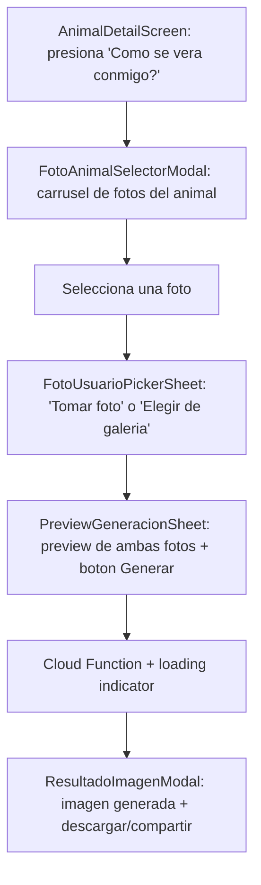

## Fase 4 — Modulo 1: Adopcion

### 4.1 Pantallas del adoptante — `src/modules/adopcion/screens/`

| Pantalla | RF | Descripcion |
|---|---|---|
| `CatalogoScreen` | RF-02, RF-03 | FlatList con busqueda y filtros. Pull-to-refresh. |
| `AnimalDetailScreen` | RF-02 | Carrusel de fotos, datos completos, boton "Solicitar Adopcion", boton "Como se vera conmigo?" (accent) |
| `SolicitudScreen` | RF-04 | Formulario RHF + `solicitudSchema`, sube 3 imagenes a Storage, crea doc en `solicitudes` |
| `MisSolicitudesScreen` | RF-11 | Lista de solicitudes propias con estado actual |

### 4.2 Filtros del catalogo — `CatalogoScreen`

| Filtro | Tipo | Opciones |
|---|---|---|
| `especie` | Selector | Perro / Gato |
| `edad` | Rango numerico | Por años |
| `tamaño` | Selector | Pequeno / Mediano / Grande |
| `esterilizado` | Toggle | Si / No / Todos |

El query en `useAnimales.ts` agrega `.where('esterilizado', '==', valor)` solo cuando el filtro no esta en "Todos".

### 4.3 Pantallas del personal — `src/modules/adopcion/screens/`

| Pantalla | RF | Descripcion |
|---|---|---|
| `GestionAnimalesScreen` | RF-01 | Lista de animales + FAB para agregar, accion de editar por animal |
| `RegistroAnimalScreen` | RF-01 | Formulario de registro con image picker |
| `EditarAnimalScreen` | RF-01 | Carga datos existentes, permite editar todos los campos y gestionar imagenes |
| `GestionSolicitudesScreen` | RF-05, RF-10 | Lista de solicitudes, revisar, aprobar/rechazar |
| `AgendarEntrevistaScreen` | RF-12 | Formulario para agendar entrevista. Si `solicitud.viveAcompanado == true`, muestra banner de advertencia |
| `EntrevistasScreen` | RF-13 | Lista de entrevistas con estado y resultado |

### 4.4 Banner de convivencia en entrevistas

Cuando `solicitud.viveAcompanado == true`:
- `AgendarEntrevistaScreen` muestra un banner destacado antes del formulario:
  > "El adoptante vive acompanado. Debe asistir a la entrevista con al menos una persona mayor de 18 años que conviva con el/ella."
- `InterviewCard` muestra un indicador visual recordando el requisito de acompanante

### 4.5 Componentes — `src/modules/adopcion/components/`

| Componente | Descripcion |
|---|---|
| `AnimalCard.tsx` | Card con `fotos[0]` como imagen, nombre, especie, edad formateada, badge de estado. Animacion `FadeInUp` con Reanimated (respeta `useReducedMotion()`) |
| `AnimalRegistrationForm.tsx` | Formulario completo RHF + `animalSchema` |
| `AdoptionForm.tsx` | Formulario RHF + `solicitudSchema` con 3 image pickers, checkbox de convivencia |
| `StatusBadge.tsx` | Reutiliza shared. Colores: secondary=aprobada, accent=pendiente, error=rechazada |
| `InterviewCard.tsx` | Fecha, estado, notas, indicador de acompanante si aplica |
| `SolicitudList.tsx` | FlatList con tabs de filtro por estado |

### 4.6 Campos de `AnimalRegistrationForm.tsx`

| Campo | Tipo de input |
|---|---|
| `nombre` | TextInput |
| `especie` | Selector (perro / gato) |
| `raza` | TextInput |
| `edad.anios` | TextInput numerico, opcional |
| `edad.meses` | TextInput numerico 0-11, opcional |
| `edad.dias` | TextInput numerico 0-30, opcional |
| `sexo` | Selector (macho / hembra) |
| `tamaño` | Selector (pequeno / mediano / grande) |
| `descripcion` | TextInput multiline |
| `estadoSalud` | TextInput |
| `vacunado` | Checkbox / Switch |
| `esterilizado` | Checkbox / Switch |
| `fotos` | Image picker multiple, maximo 5 |

- El campo `ubicacion` **no aparece en el formulario**. Se pre-llena automaticamente con la direccion de la fundacion al crear el documento en `animalesService.ts`.
- La primera foto subida es la portada (badge visual "Portada").
- Al editar, se pueden agregar fotos nuevas si el total no supera 5, y eliminar fotos existentes.

### 4.7 Campos de `AdoptionForm.tsx` (Solicitud de adopcion RF-04)

| Campo | Tipo de input | Validacion Yup |
|---|---|---|
| `nombreCompleto` | TextInput | Requerido, min 5 caracteres |
| `fotoCedulaFrontal` | Image picker | Requerido |
| `fotoCedulaPosterior` | Image picker | Requerido |
| `telefonoCelular` | TextInput numerico | Opcional, pero al menos uno de celular/fijo requerido |
| `telefonoFijo` | TextInput numerico | Opcional, pero al menos uno de celular/fijo requerido |
| `ingresosMensuales` | TextInput numerico | Requerido, positivo |
| `fotoUbicacionAnimal` | Image picker | Requerido |
| `viveAcompanado` | Checkbox | Requerido ("Vive usted con al menos una persona mayor de 18 años?") |

Validacion cruzada: al menos uno de `telefonoCelular` o `telefonoFijo` debe tener valor (via `.test()` de Yup).

### 4.8 Schemas Yup — `src/modules/adopcion/schemas/`

**`animalSchema.ts`:**
- `nombre`: requerido
- `especie`: oneOf `['perro', 'gato']`, requerido
- `raza`: requerido
- `edad`: objeto con validacion cruzada — al menos uno de `anios`, `meses` o `dias` debe tener valor
- `sexo`: requerido
- `tamaño`: requerido
- `descripcion`: min 20 caracteres, requerido
- `estadoSalud`: requerido
- `vacunado`: booleano requerido
- `esterilizado`: booleano requerido
- `fotos`: array de strings, min 1, max 5, requerido

**`solicitudSchema.ts`:**
- `nombreCompleto`: requerido, min 5
- `fotoCedulaFrontal`: string requerido (URI)
- `fotoCedulaPosterior`: string requerido (URI)
- `telefonoCelular`: opcional, validacion cruzada con `telefonoFijo`
- `telefonoFijo`: opcional, validacion cruzada con `telefonoCelular`
- `ingresosMensuales`: numero requerido, positivo
- `fotoUbicacionAnimal`: string requerido (URI)
- `viveAcompanado`: booleano requerido

**`entrevistaSchema.ts`:**
- `fecha`: requerida, debe ser futura
- `hora`: requerida
- `notas`: opcional

### 4.9 Servicios — `src/modules/adopcion/services/`

**`animalesService.ts`:**

| Funcion | Descripcion |
|---|---|
| `registrarAnimal()` | Sube fotos a Storage en `/animales/{animalId}/`, guarda URLs en Firestore. Pre-llena `ubicacion` con direccion de la fundacion |
| `editarAnimal()` | Actualiza todos los campos del documento en Firestore |
| `agregarFoto()` | Sube imagen nueva a Storage, anade URL al array `fotos` si `length < 5` |
| `eliminarFoto()` | Elimina imagen de Storage y remueve URL del array `fotos` con `arrayRemove` |

**`solicitudesService.ts`:**
- Crear solicitud (sube 3 imagenes a Storage en `/solicitudes/{solicitudId}/`)
- Listar por adoptante / listar todas (personal)
- Cambiar estado (personal)

**`entrevistasService.ts`:**
- Crear, listar, actualizar estado/resultado

### 4.10 Hooks — `src/modules/adopcion/hooks/`

| Hook | Proposito |
|---|---|
| `useAnimales.ts` | Suscripcion real-time al catalogo con filtros (especie, edad, tamaño, esterilizado) |
| `useSolicitudes.ts` | Solicitudes del adoptante o todas (personal) |
| `useEntrevistas.ts` | Entrevistas del personal |

### 4.11 Utilidad — `src/modules/adopcion/utils/formatEdad.ts`

Funcion pura que recibe `Edad` y retorna string legible:
- `{ anios: 1, meses: 2 }` → `"1 ano, 2 meses"`
- `{ dias: 10 }` → `"10 dias"`
- `{ anios: 3 }` → `"3 años"`

Usada en `AnimalCard.tsx` y `AnimalDetailScreen.tsx`.

### 4.12 RF-10: Automatizacion de estado

Al aprobar una solicitud y confirmar entrega → el servicio actualiza `animales/{id}.estado` a `'adoptado'` en la misma transaccion.

### 4.13 Reglas de Firestore — Modulo Adopcion

```
rules_version = '2';
service cloud.firestore {
  match /databases/{database}/documents {
    function getRole() {
      return get(/databases/$(database)/documents/users/$(request.auth.uid)).data.role;
    }
    function isAuthenticated() {
      return request.auth != null;
    }
    function isSuperadmin() {
      return isAuthenticated() && getRole() == 'superadmin';
    }

    match /users/{userId} {
      allow read: if isAuthenticated() && (request.auth.uid == userId || isSuperadmin());
      allow create: if (isAuthenticated() &&
        request.auth.uid == userId &&
        request.resource.data.uid == userId &&
        request.resource.data.role == 'adoptante') ||
        isSuperadmin();
      allow update: if isSuperadmin();
    }

    match /animales/{animalId} {
      allow read: if isAuthenticated();
      allow create, update, delete: if getRole() == 'personal';
    }

    match /solicitudes/{solicitudId} {
      allow read: if isAuthenticated() &&
        (resource.data.adoptanteId == request.auth.uid || getRole() == 'personal');
      allow create: if getRole() == 'adoptante';
      allow update: if getRole() == 'personal';
    }

    match /entrevistas/{entrevistaId} {
      allow read, write: if getRole() == 'personal';
    }
  }
}
```

### 4.14 Reglas de Storage — Modulo Adopcion

```
match /animales/{imageId} {
  allow read: if request.auth != null;
  allow write: if getRole() == 'personal';
}

match /solicitudes/{solicitudId}/{imageId} {
  allow read: if request.auth != null &&
    (getRole() == 'personal' || resource.metadata.uploadedBy == request.auth.uid);
  allow write: if request.auth != null && getRole() == 'adoptante';
}
```

---

## Fase 5 — Modulo 2: Mascotas Extraviadas

### 5.1 Pantallas — `src/modules/mascotas/screens/`

| Pantalla | RF | Descripcion |
|---|---|---|
| `ReportarScreen` | RF-06 | Formulario con image picker, expo-location para pre-fill, map pin picker |
| `ListaReportesScreen` | RF-07 | FlatList unico (sin tabs de tipo) con reportes `estado === 'activo'` y busqueda |
| `MapaScreen` | RF-08 | MapView full-screen con marcadores de reportes activos, callouts con resumen |
| `DetalleReporteScreen` | — | Detalle completo, boton WhatsApp, boton "Mascota encontrada" (solo para el creador) |

### 5.2 Componentes — `src/modules/mascotas/components/`

| Componente | Descripcion |
|---|---|
| `ReporteForm.tsx` | RHF + `reporteSchema`, image picker (max 3), map pin picker |
| `ReporteCard.tsx` | Imagen (`fotos[0]`), nombre, especie, fecha, ubicacion |
| `MapaReportes.tsx` | `<MapView>` con marcadores custom |

### 5.3 Campos de `ReporteForm.tsx`

| Campo | Tipo de input |
|---|---|
| `nombre` | TextInput |
| `especie` | Selector (perro / gato) |
| `descripcion` | TextInput multiline |
| `fotos` | Image picker multiple, maximo 3 |
| `ultimaUbicacion` | Map pin picker con expo-location para pre-fill |
| `telefonoContacto` | TextInput numerico |

### 5.4 Schema Yup — `src/modules/mascotas/schemas/reporteSchema.ts`

- `nombre`: requerido
- `especie`: oneOf `['perro', 'gato']`, requerido
- `descripcion`: min 20 caracteres, requerido
- `fotos`: array, min 1, max 3, requerido
- `ultimaUbicacion`: objeto con `latitude`, `longitude`, `direccion` requeridos
- `telefonoContacto`: regex `/^[0-9]{10}$/`, requerido

### 5.5 Limite de publicacion — una vez cada 14 dias

**Archivo:** `src/modules/mascotas/services/reportesService.ts`

Antes de crear el reporte, consultar si el usuario tiene un reporte en los ultimos 14 dias. Si existe, lanzar error con mensaje indicando cuantos dias faltan para poder publicar nuevamente.

### 5.6 Boton de WhatsApp — `DetalleReporteScreen.tsx`

- Boton "Contactar por WhatsApp" con el color propio de WhatsApp
- URL: `https://wa.me/593${telefono.slice(1)}` (prefijo Ecuador, elimina 0 inicial)
- Usa `Linking.openURL()`

### 5.7 Cambio de estado del reporte

- Boton "Mascota encontrada" visible solo si `reporte.reportadoPor === currentUser.uid`
- Actualiza `estado` a `'resuelto'` en Firestore
- Reportes resueltos no aparecen en lista ni en mapa

### 5.8 Cloud Function: Notificacion geolocalizada (RF-07)

**`functions/src/notifications.ts`**
- Trigger: `onCreate` en coleccion `reportes`
- Lee ubicacion del reporte
- Consulta usuarios con `fcmToken` en el area (radius configurable)
- Envia notificacion push via FCM

### 5.9 Reglas de Firestore — Modulo Mascotas

```
match /reportes/{reporteId} {
  allow read: if isAuthenticated();
  allow create: if isAuthenticated();
  allow update: if isAuthenticated() &&
    resource.data.reportadoPor == request.auth.uid;
  allow delete: if false;
}
```

### 5.10 Reglas de Storage — Modulo Mascotas

```
match /reportes/{reporteId}/{imageId} {
  allow read: if request.auth != null;
  allow write: if request.auth != null;
}
```

---

## Fase 6 — Modulo 3: IA Generativa

### 6.1 Flujo completo (dentro de `AnimalDetailScreen`)

No hay pantalla separada. El flujo se activa desde `AnimalDetailScreen` con el boton "Como se vera conmigo?" (color accent).



### 6.2 Componentes — `src/modules/ia-generativa/components/`

| Componente | Descripcion |
|---|---|
| `FotoAnimalSelectorModal.tsx` | Modal con carrusel horizontal de fotos del animal |
| `FotoUsuarioPickerSheet.tsx` | Bottom sheet: tomar foto o elegir de galeria |
| `PreviewGeneracionSheet.tsx` | Vista previa de ambas fotos + boton "Generar imagen" |
| `ResultadoImagenModal.tsx` | Imagen generada sin marca de agua + botones descargar y compartir |
| `ContadorGeneraciones.tsx` | Muestra "Te quedan X generaciones hoy" con color segun cantidad |

### 6.3 Colores del contador de generaciones

| Generaciones restantes | Color |
|---|---|
| 3 | secondary (`#4CAF96`) |
| 2 | accent (`#FF8F4A`) |
| 1 | error (`#E53935`) |
| 0 | error (`#E53935`) + mensaje "Vuelve manana" |

### 6.4 Rate limiting — coleccion `generaciones`

**Archivo:** `src/modules/ia-generativa/services/generarImagenService.ts`

- Documento ID: `{uid}_{YYYY-MM-DD}`
- Antes de generar, leer contador del dia
- Si `cantidad >= 3`, lanzar error
- Tras generacion exitosa, incrementar contador con `set({ merge: true })`
- La Cloud Function valida nuevamente del lado del servidor como segunda capa

### 6.5 Cloud Function: Proxy de Gemini

**`functions/src/gemini.ts`**
- HTTP callable function
- Recibe: `{ userImageBase64: string, animalImageBase64: string }`
- Lee `GEMINI_API_KEY` de `functions/.env`
- Llama a Imagen 3 via axios con ambas imagenes en base64
- Retorna imagen generada en base64
- Validacion de entrada + rate limiting server-side

### 6.6 Reglas de Firestore — coleccion generaciones

```
match /generaciones/{docId} {
  allow read: if isAuthenticated() &&
    resource.data.uid == request.auth.uid;
  allow write: if isAuthenticated() &&
    request.resource.data.uid == request.auth.uid;
}
```

---

## Fase 7 — Superadmin

### 7.1 Pantalla — `src/modules/superadmin/screens/GestionUsuariosScreen.tsx`

Lista usuarios del personal, crear cuenta, desactivar cuenta.

### 7.2 Cloud Function — `functions/src/users.ts`

Crear usuario en Auth + documento en Firestore con rol `personal`. Necesario porque crear usuarios desde el cliente requiere Admin SDK.

---

## Reglas de Firestore completas

```
rules_version = '2';
service cloud.firestore {
  match /databases/{database}/documents {
    function getRole() {
      return get(/databases/$(database)/documents/users/$(request.auth.uid)).data.role;
    }
    function isAuthenticated() {
      return request.auth != null;
    }
    function isSuperadmin() {
      return isAuthenticated() && getRole() == 'superadmin';
    }

    match /users/{userId} {
      allow read: if isAuthenticated() && (request.auth.uid == userId || isSuperadmin());
      allow create: if (isAuthenticated() &&
        request.auth.uid == userId &&
        request.resource.data.uid == userId &&
        request.resource.data.role == 'adoptante') ||
        isSuperadmin();
      allow update: if isSuperadmin();
    }

    match /animales/{animalId} {
      allow read: if isAuthenticated();
      allow create, update, delete: if getRole() == 'personal';
    }

    match /solicitudes/{solicitudId} {
      allow read: if isAuthenticated() &&
        (resource.data.adoptanteId == request.auth.uid || getRole() == 'personal');
      allow create: if getRole() == 'adoptante';
      allow update: if getRole() == 'personal';
    }

    match /entrevistas/{entrevistaId} {
      allow read, write: if getRole() == 'personal';
    }

    match /reportes/{reporteId} {
      allow read: if isAuthenticated();
      allow create: if isAuthenticated();
      allow update: if isAuthenticated() &&
        resource.data.reportadoPor == request.auth.uid;
      allow delete: if false;
    }

    match /generaciones/{docId} {
      allow read: if isAuthenticated() &&
        resource.data.uid == request.auth.uid;
      allow write: if isAuthenticated() &&
        request.resource.data.uid == request.auth.uid;
    }
  }
}
```

## Reglas de Storage completas

```
rules_version = '2';
service firebase.storage {
  match /b/{bucket}/o {
    function getRole() {
      return firestore.get(/databases/(default)/documents/users/$(request.auth.uid)).data.role;
    }

    match /animales/{imageId} {
      allow read: if request.auth != null;
      allow write: if getRole() == 'personal';
    }

    match /solicitudes/{solicitudId}/{imageId} {
      allow read: if request.auth != null &&
        (getRole() == 'personal' || resource.metadata.uploadedBy == request.auth.uid);
      allow write: if request.auth != null && getRole() == 'adoptante';
    }

    match /reportes/{reporteId}/{imageId} {
      allow read: if request.auth != null;
      allow write: if request.auth != null;
    }
  }
}
```

---

## Resumen de archivos por fase

| Fase | Archivos nuevos | Archivos modificados |
|---|---|---|
| 0 | `.env`, `functions/.env` | `.gitignore` |
| 1 | `app.config.ts`, `functions/` | `package.json`, `tsconfig.json` |
| 2 | `src/theme/*`, `src/shared/**/*` | `constants/theme.ts`, `hooks/use-theme-color.ts` |
| 3 | `app/_layout.tsx` (reescribir), `app/(auth)/*`, `src/shared/schemas/*` | — |
| 4 | `src/modules/adopcion/**/*`, `app/(adoptante)/*`, `app/(personal)/*`, `firestore.rules`, `storage.rules` | — |
| 5 | `src/modules/mascotas/**/*`, rutas de reportes, `functions/src/notifications.ts` | `firestore.rules`, `storage.rules` |
| 6 | `src/modules/ia-generativa/components/*`, `src/modules/ia-generativa/services/*`, `functions/src/gemini.ts` | `firestore.rules`, `AnimalDetailScreen.tsx` |
| 7 | `src/modules/superadmin/**/*`, `functions/src/users.ts`, `app/(superadmin)/*` | — |

---

## Verificacion / Definition of Done

| Criterio | Validacion |
|---|---|
| Firebase conectado | Auth flow funcional, Firestore lee/escribe correctamente |
| Solo Android | No existe configuracion iOS en `app.config.ts`, build Android exitoso |
| Enrutamiento por rol | Cada rol llega a su layout; acceso no autorizado redirigido |
| Formularios | Envio invalido muestra errores inline de yup; envio valido crea documento |
| Formulario solicitud | 3 image pickers funcionan, validacion cruzada de telefonos, imagenes suben a Storage |
| Formulario animal | Edad flexible (solo anios, solo dias, combinaciones), max 5 fotos, portada correcta |
| Edicion animal | Pre-llena datos, agrega/elimina fotos, portada se actualiza |
| Catalogo tiempo real | Cambios en animales se reflejan sin recargar, filtro esterilizado funcional |
| Solicitudes | Adoptante crea, personal aprueba/rechaza, estado se refleja |
| Mensaje convivencia | Banner visible solo cuando `viveAcompanado == true` en la solicitud vinculada |
| Reportes | Formulario sin campo tipo, limite 14 dias, solo creador resuelve |
| WhatsApp | Boton abre WhatsApp con numero correcto (prefijo 593) |
| Reportes ocultos | Resueltos no aparecen en lista ni mapa |
| Notificaciones | Reporte creado dispara push a usuarios cercaños |
| IA generativa | Flujo completo en modales desde AnimalDetailScreen |
| Limite 3/dia | Cuarta generacion muestra error + "Vuelve manana" |
| Sin marca de agua | Imagen generada se descarga sin watermark |
| Colores | Ningun hex hardcodeado fuera de `colors.ts` |
| TypeScript | `npx tsc --noEmit` sin errores |
| Animaciones | Smooth en dispositivo, respetan `prefers-reduced-motion` |
| Seguridad | Rules de Firestore/Storage validan rol en cada operacion |

### Trazabilidad paso → objetivo → verificacion

| Paso | Targets | Verificacion |
|---|---|---|
| Fase 0 | Firebase configurado | Servicios visibles en consola, superadmin creado |
| Fase 1 | Dependencias + estructura | `npm install` sin errores, carpetas creadas |
| Fase 2 | Theme + servicios + tipos | `tsc --noEmit` pasa, Firebase init exitoso |
| Fase 3 | Auth + routing | Login/registro funcional, redireccion por rol |
| Fase 4 | Modulo Adopcion | RF-01 a RF-05, RF-10 a RF-13 verificados |
| Fase 5 | Modulo Mascotas | RF-06 a RF-08 verificados, push notifications |
| Fase 6 | Modulo IA | RF-09 verificado, proxy funcional, rate limit |
| Fase 7 | Superadmin | Crear/desactivar personal funcional |
 