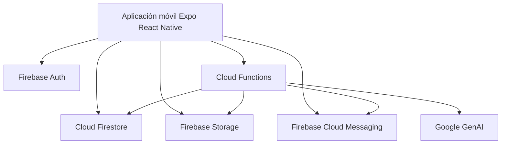
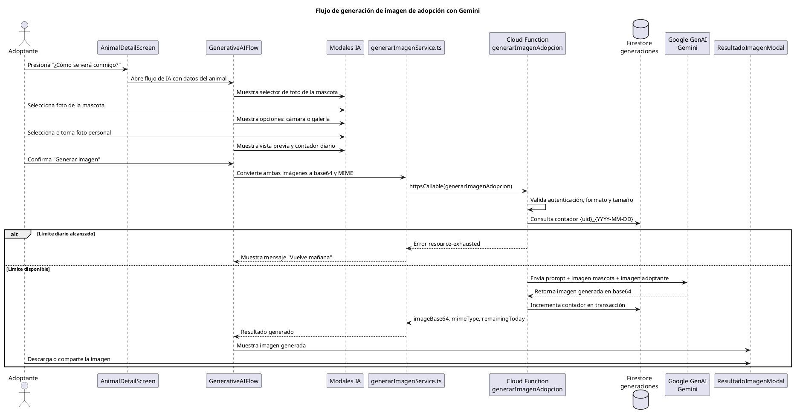
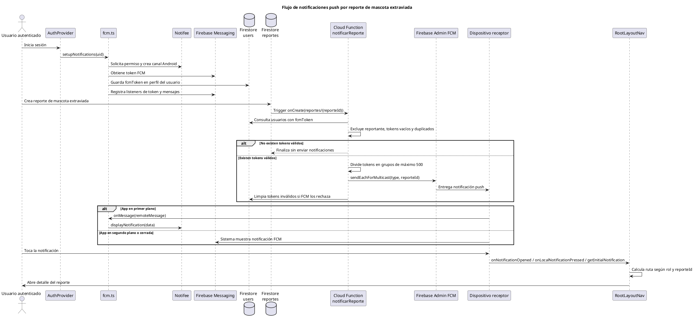

# Fundación Huellitas App

## Apoyo para el capítulo 3.3.4: Construcción del desarrollo

Este documento resume la construcción técnica de la aplicación móvil **Fundación Huellitas** y puede utilizarse como base para redactar el capítulo **3.3.4 Construcción** de la tesis. La información fue organizada a partir de la revisión del repositorio actual y de las memorias registradas en Engram sobre el proyecto.

## 1. Resumen del proyecto

La aplicación Fundación Huellitas es una solución móvil orientada a apoyar los procesos de adopción responsable y reporte de mascotas extraviadas. El sistema fue construido como una aplicación Android con **Expo**, **React Native**, **TypeScript** y servicios de **Firebase**, integrando autenticación por roles, persistencia en tiempo real, almacenamiento de imágenes, notificaciones push y funciones serverless.

El proyecto contempla tres perfiles principales de usuario:

| Rol | Propósito dentro del sistema |
| --- | --- |
| Adoptante | Consulta mascotas disponibles, solicita adopciones, reporta mascotas extraviadas, revisa sus solicitudes y utiliza el flujo de IA generativa. |
| Personal | Registra y administra mascotas, revisa solicitudes, agenda entrevistas y consulta reportes. |
| Superadmin | Administra cuentas del personal y activa o desactiva usuarios. |

## 2. Tecnologías utilizadas

| Capa | Tecnología | Uso en la construcción |
| --- | --- | --- |
| Aplicación móvil | Expo 54, React Native 0.81, React 19 | Construcción de interfaces móviles y navegación. |
| Lenguaje | TypeScript | Tipado de modelos, servicios, hooks y funciones. |
| Navegación | Expo Router | Separación de rutas por rol: adoptante, personal, superadmin y autenticación. |
| Formularios | React Hook Form y Yup | Captura y validación de datos en formularios de registro, adopción, reportes y personal. |
| Backend | Firebase Auth, Firestore, Storage, Cloud Functions | Autenticación, base de datos, imágenes y lógica serverless. |
| Notificaciones | Firebase Cloud Messaging y Notifee | Registro de token FCM, recepción y visualización de notificaciones push. |
| Mapas y ubicación | react-native-maps, expo-location | Selección y visualización de ubicación en reportes de mascotas extraviadas. |
| IA generativa | Google GenAI en Cloud Functions | Generación de imagen de vista previa de adopción. |

## 3. Estructura construida del proyecto

La construcción se organizó por capas y módulos para mantener separación de responsabilidades:

```text
app/
  (auth)/              Rutas de inicio de sesión y registro
  (adoptante)/         Pantallas del usuario adoptante
  (personal)/          Pantallas del personal de la fundación
  (superadmin)/        Pantallas administrativas

src/
  modules/
    adopcion/          Lógica de mascotas, solicitudes y entrevistas
    mascotas/          Lógica de reportes de mascotas extraviadas
    ia-generativa/     Flujo de generación de imágenes con IA
    superadmin/        Gestión de usuarios del personal
  shared/              Componentes, hooks, servicios Firebase y tipos comunes
  theme/               Colores, espaciado, tipografía y animaciones

functions/
  src/
    gemini.ts          Función callable para generación de imágenes
    notifications.ts   Funciones de notificación FCM
    users.ts           Funciones de gestión de personal
    eliminarCuenta.ts  Función para eliminación de cuenta adoptante
```

## 4. Arquitectura implementada

La aplicación se construyó bajo una arquitectura cliente móvil más backend serverless:



En el cliente móvil se implementan las pantallas, validaciones, navegación por rol y consumo de servicios. Firebase proporciona autenticación, reglas de seguridad, almacenamiento de imágenes, sincronización de datos y ejecución de lógica de servidor mediante Cloud Functions.

## 5. Construcción por módulos funcionales

### 5.1 Autenticación, perfiles y control de acceso

La autenticación se construyó con Firebase Auth. El registro crea usuarios adoptantes y almacena su perfil en la colección `users`. El inicio de sesión recupera el perfil del usuario y permite redirigirlo según su rol.

Archivos representativos:

- `app/_layout.tsx`: controla la redirección global según autenticación y rol.
- `src/shared/hooks/useAuth.tsx`: centraliza sesión, perfil, registro, cierre de sesión, actualización de perfil y token FCM.
- `src/shared/components/RoleGuard.tsx`: protege pantallas según roles permitidos.
- `src/shared/services/firebase/auth.ts`: integra Auth, Firestore y Cloud Functions para operaciones de cuenta.
- `app/(auth)/privacy.tsx`: presenta la política de privacidad.
- `src/shared/constants/privacy.ts`: centraliza versión de política y finalidades de tratamiento.

Durante la construcción se agregó el campo `activo` para evitar que usuarios desactivados continúen accediendo a la aplicación. Además, para cubrir RNF-03, el registro de adoptantes exige consentimiento informado mediante un checkbox obligatorio, permite consultar la política de privacidad y muestra un modal con la finalidad del tratamiento de datos.

### 5.2 Módulo de adopción

El módulo de adopción permite al personal registrar animales y a los adoptantes revisar el catálogo y enviar solicitudes.

Funcionalidades construidas:

- Catálogo de animales disponibles con filtros.
- Detalle de mascota con imágenes y datos principales.
- Registro y edición de animales por parte del personal.
- Solicitud de adopción con imágenes obligatorias.
- Seguimiento de solicitudes por parte del adoptante.
- Gestión de solicitudes por parte del personal.
- Programación y actualización de entrevistas.
- Confirmación de entrega, actualizando el estado del animal a `adoptado`.

Archivos representativos:

- `src/modules/adopcion/services/animalesService.ts`
- `src/modules/adopcion/services/solicitudesService.ts`
- `src/modules/adopcion/services/entrevistasService.ts`
- `src/modules/adopcion/hooks/useAnimales.ts`
- `src/modules/adopcion/hooks/useSolicitudes.ts`
- `src/modules/adopcion/components/AnimalRegistrationForm.tsx`
- `src/modules/adopcion/components/SolicitudCard.tsx`

### 5.3 Módulo de mascotas extraviadas

El módulo de mascotas extraviadas permite crear reportes con fotos, ubicación y teléfono de contacto. Los reportes activos se muestran en lista y mapa.

Funcionalidades construidas:

- Formulario de reporte con validaciones.
- Selección de ubicación mediante mapa y búsqueda de lugares.
- Subida de hasta tres imágenes a Firebase Storage.
- Listado de reportes activos con búsqueda.
- Visualización de reportes en mapa.
- Detalle de reporte con galería de imágenes.
- Contacto por WhatsApp usando el número registrado.
- Marcado de reporte como resuelto por el usuario creador.
- Límite de publicación de un reporte cada 14 días por usuario.

Archivos representativos:

- `src/modules/mascotas/services/reportesService.ts`
- `src/modules/mascotas/hooks/useReportes.ts`
- `src/modules/mascotas/components/ReporteForm.tsx`
- `src/modules/mascotas/components/ReportesList.tsx`
- `src/modules/mascotas/components/ReporteDetail.tsx`
- `src/modules/mascotas/components/MapaReportes.tsx`

Nota técnica: aunque el plan original contemplaba notificaciones geolocalizadas, la implementación final ya no usa filtro por cercanía. La versión actual de `functions/src/notifications.ts` envía la notificación de nuevo reporte a usuarios con token FCM válido, excluyendo al usuario que creó el reporte.

### 5.4 Notificaciones push

Las notificaciones se construyeron con FCM y Notifee. La aplicación solicita permisos, crea el canal de Android, registra el token FCM en el perfil del usuario y escucha mensajes en primer plano.

Funcionalidades construidas:

- Registro y actualización de token FCM.
- Limpieza del token al cerrar sesión.
- Visualización de notificaciones en primer plano con Notifee.
- Notificación automática al crear un reporte.
- Apertura del detalle del reporte al tocar la notificación.
- Eliminación de tokens inválidos desde Cloud Functions.

Archivos representativos:

- `src/shared/services/notifications/fcm.ts`
- `src/shared/hooks/useAuth.tsx`
- `app/_layout.tsx`
- `functions/src/notifications.ts`

### 5.5 Módulo de IA generativa

El módulo de IA generativa se integró en el detalle de una mascota. Su finalidad es generar una imagen referencial del adoptante con la mascota, como apoyo emocional al proceso de adopción.

Flujo construido:

1. El adoptante entra al detalle de una mascota.
2. Selecciona una foto de la mascota.
3. Selecciona o toma una foto personal.
4. Revisa la vista previa de ambas imágenes.
5. Solicita la generación de imagen.
6. La Cloud Function llama a Google GenAI.
7. La app muestra el resultado y permite compartirlo o guardarlo.

Controles implementados:

- Límite de tres generaciones por usuario al día.
- Validación de formatos de imagen.
- Límite de tamaño de imágenes enviadas.
- Generación del contador diario usando zona horaria `America/Guayaquil`.
- Registro del uso diario en la colección `generaciones`.

Prompt usado en la Cloud Function:

```text
Create a warm, realistic vertical portrait for an animal adoption preview.
Use the pet from the first image as {nombreMascota}.
Use the person from the second image as the adopter.
Compose them together in a cozy home, with natural soft light, emotional but realistic.
Preserve the pet's recognizable traits and avoid adding text, logos, UI elements, or watermarks.
```

En la implementación, `{nombreMascota}` se reemplaza por el nombre real del animal. Si no existe, se usa `la mascota`.

Archivos representativos:

- `src/modules/ia-generativa/components/GenerativeAIFlow.tsx`
- `src/modules/ia-generativa/components/FotoAnimalSelectorModal.tsx`
- `src/modules/ia-generativa/components/FotoUsuarioPickerSheet.tsx`
- `src/modules/ia-generativa/components/PreviewGeneracionSheet.tsx`
- `src/modules/ia-generativa/components/ResultadoImagenModal.tsx`
- `src/modules/ia-generativa/services/generarImagenService.ts`
- `functions/src/gemini.ts`

### 5.6 Módulo de superadmin

El módulo de superadmin permite administrar usuarios del personal desde la aplicación móvil.

Funcionalidades construidas:

- Crear cuentas del personal.
- Editar nombre, correo, teléfono y foto de perfil.
- Desactivar y reactivar usuarios del personal.
- Probar el envío de notificaciones.
- Validar que solo un superadmin activo pueda ejecutar estas acciones.

Archivos representativos:

- `src/modules/superadmin/screens/GestionUsuariosScreen.tsx`
- `src/modules/superadmin/services/personalService.ts`
- `src/modules/superadmin/hooks/usePersonalUsers.ts`
- `functions/src/users.ts`

## 6. Modelo de datos construido

| Colección | Descripción |
| --- | --- |
| `users` | Perfiles de usuario, rol, estado activo, teléfono, foto, token FCM y constancia del consentimiento de privacidad. |
| `userPhones` | Índice auxiliar para evitar duplicidad de números telefónicos. |
| `animales` | Mascotas registradas por el personal, con datos de salud, fotos y estado. |
| `solicitudes` | Solicitudes de adopción creadas por adoptantes. |
| `entrevistas` | Entrevistas agendadas y actualizadas por el personal. |
| `reportes` | Reportes de mascotas extraviadas con ubicación, fotos y estado. |
| `generaciones` | Contador diario de imágenes generadas con IA por usuario. |

Los modelos principales están tipados en `src/shared/types/models.ts`, lo que permitió mantener consistencia entre pantallas, servicios, hooks y reglas de negocio.

## 7. Validación de datos

La validación de formularios se construyó con Yup en los bordes de entrada del sistema. Esto evita almacenar datos incompletos o con formato incorrecto.

Ejemplos:

- Registro e inicio de sesión: correo válido, contraseña mínima, confirmación y aceptación obligatoria de la política de privacidad.
- Registro de animales: especie, sexo, edad flexible, estado de salud, vacunas, esterilización, desparasitación y máximo cinco fotos.
- Solicitud de adopción: datos personales, fotografías obligatorias, ingresos y al menos un teléfono.
- Reporte de mascota: especie, sexo, descripción, ubicación, teléfono de diez dígitos y máximo tres fotos.
- Personal: nombre, correo, contraseña temporal y teléfono opcional.

Archivos representativos:

- `src/shared/schemas/loginSchema.ts`
- `src/shared/schemas/registerSchema.ts`
- `src/modules/adopcion/schemas/animalSchema.ts`
- `src/modules/adopcion/schemas/solicitudSchema.ts`
- `src/modules/mascotas/schemas/reporteSchema.ts`
- `src/modules/superadmin/schemas/personalSchema.ts`

## 8. Seguridad construida

La seguridad se implementó con reglas de Firestore y Storage, además de validaciones en Cloud Functions.

Medidas aplicadas:

- Acceso autenticado obligatorio para leer información principal.
- Control de permisos por rol.
- Protección de rutas en el cliente mediante `RoleGuard`.
- Validación de usuario activo antes de permitir acceso.
- Consentimiento informado obligatorio antes de crear una cuenta de adoptante.
- Registro de `consentimientoPrivacidad`, `consentimientoPrivacidadVersion` y `consentimientoPrivacidadAceptadoEn` en el documento del usuario.
- Pantalla de política de privacidad y modal de finalidad del tratamiento de datos.
- Escritura de animales limitada al personal.
- Gestión de personal limitada al superadmin.
- Actualización de solicitudes limitada al personal.
- Resolución de reportes limitada al usuario creador.
- Escritura directa de la colección `generaciones` bloqueada desde el cliente.
- Limpieza de cuenta adoptante mediante Cloud Function.

Archivos representativos:

- `firestore.rules`
- `storage.rules`
- `functions/src/users.ts`
- `functions/src/eliminarCuenta.ts`
- `functions/src/gemini.ts`

### 8.1 RNF-03: Privacidad, consentimiento y supresión

Para reforzar el cumplimiento del RNF-03 se agregó una política de privacidad dentro de la aplicación y un consentimiento explícito en el registro. Antes de crear la cuenta, el adoptante debe aceptar que sus datos se usen únicamente para el funcionamiento de la aplicación: administración de cuenta, gestión de adopciones, reportes de mascotas, contacto necesario, notificaciones y control de acceso por rol.

La aceptación queda registrada en Firestore junto con la versión de la política y la fecha de aceptación. La supresión de datos se mantiene desde el perfil y está disponible para usuarios con rol `adoptante`, de acuerdo con el alcance definido para la aplicación.

Archivos representativos:

- `app/(auth)/privacy.tsx`
- `app/(auth)/register.tsx`
- `src/shared/constants/privacy.ts`
- `src/shared/schemas/registerSchema.ts`
- `src/shared/services/firebase/auth.ts`
- `src/shared/hooks/useAuth.tsx`

## 9. Construcción de la experiencia de usuario

La interfaz se construyó con componentes reutilizables, estados visuales y una línea gráfica coherente para la fundación.

Elementos UX implementados:

- Navegación inferior diferenciada por rol.
- Tarjetas para mascotas, solicitudes y reportes.
- Estados de carga, vacío y error.
- Formularios con mensajes de error inline.
- Filtros y búsqueda para mejorar la localización de información.
- Mapas para reportes de mascotas extraviadas.
- Modales y hojas inferiores para el flujo de IA generativa.
- Galerías de imágenes en detalles.
- Microinteracciones y animaciones suaves con soporte para reducción de movimiento.

Archivos representativos:

- `src/theme/colors.ts`
- `src/theme/spacing.ts`
- `src/theme/typography.ts`
- `src/theme/animations.ts`
- `src/shared/components/EmptyState.tsx`
- `src/shared/components/LoadingIndicator.tsx`
- `src/shared/components/FormField.tsx`
- `src/shared/components/StatusBadge.tsx`


## 10. Comandos de construcción y verificación

Comandos principales del proyecto móvil:

```powershell
npm install
npm start
npm run android
npm run lint
npx tsc --noEmit
```

Comandos principales de Cloud Functions:

```powershell
cd functions
npm install
npm run build
npm run lint
npm run deploy
```

Comandos principales de Firebase:

```powershell
firebase deploy --only firestore:rules
firebase deploy --only storage
firebase deploy --only functions
```

Variables de entorno utilizadas:

| Variable | Ubicación | Propósito |
| --- | --- | --- |
| `GOOGLE_MAPS_API_KEY` | `.env` | Uso de mapas y búsqueda de lugares. |
| `CLOUD_FUNCTIONS_URL` | `.env` | URL base para funciones HTTP si aplica. |
| `GEMINI_API_KEY` | `functions/.env` | Acceso al servicio de generación de imágenes. |

## 11. Diagramas de secuencia PlantUML

### 11.1 Flujo de generación de imágenes con Gemini



### 11.2 Flujo del módulo de notificaciones push



## 12. Cambios respecto al plan original

| Punto del plan original | Implementación final | Cambio realizado |
| --- | --- | --- |
| Fase 5.8: notificación geolocalizada con usuarios dentro de un radio configurable. | La función `notificarReporte` consulta usuarios con `fcmToken`, excluye al reportante, elimina tokens duplicados y envía por lotes de hasta 500. | Se eliminó el criterio geolocalizado. Las notificaciones ya no se filtran por cercanía. |
| Fase 5.3: formulario de reporte sin campo `sexo`. | `ReporteFormData` y `Reporte` incluyen `sexo`. | Se agregó el sexo de la mascota para construir mensajes de notificación con concordancia gramatical: "reportado" o "reportada". |
| Fase 5.8: envío push básico. | Se agregó manejo de foreground con Notifee, canal Android, deduplicación de tokens, limpieza de tokens inválidos y apertura del detalle del reporte al tocar la notificación. | El módulo de notificaciones se fortaleció para evitar duplicados y mejorar navegación desde la notificación. |
| Fase 6.5: proxy Gemini llamando a Imagen 3 vía `axios`. | `functions/src/gemini.ts` usa `@google/genai` con el modelo `gemini-2.5-flash-image`. | Se reemplazó la llamada HTTP manual por el SDK oficial de Google GenAI y el modelo final disponible en la implementación. |
| Fase 6.5: request con `{ userImageBase64, animalImageBase64 }`. | La función recibe también `userMimeType`, `animalMimeType` y `animalName`. | Se amplió el contrato para validar formatos de imagen y personalizar el prompt con el nombre de la mascota. |
| Fase 6.4: el cliente incrementa el contador con `set({ merge: true })` y la función valida como segunda capa. | El cliente solo lee el contador; Firestore bloquea escritura directa en `generaciones` y la Cloud Function valida e incrementa en transacción. | El control de límite diario quedó centralizado del lado del servidor para mayor seguridad. |
| Fase 6.2: resultado con descarga y compartir. | La descarga se ejecuta solo bajo acción del usuario y solicita permiso de galería en ese momento. | Se evitó guardar automáticamente la imagen generada y se dejó el control explícito al usuario. |
| Fase 7: crear y desactivar personal. | El superadmin puede crear, editar, desactivar y reactivar personal. | Se amplió la gestión administrativa respecto al alcance mínimo del plan. |
| Reglas iniciales de Storage para animales como ruta simple. | Las imágenes de animales se almacenan bajo `animales/{animalId}/{imageId}`. | Se agrupó el almacenamiento por identificador de animal para mejorar organización de archivos. |
| RNF-03: privacidad y protección de datos. | Se agregó política de privacidad, consentimiento informado obligatorio, modal de finalidad de tratamiento y registro de consentimiento en `users/{uid}`. | Se reforzó el cumplimiento no funcional de protección de datos personales. |