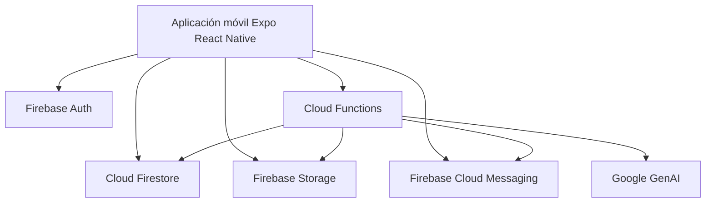
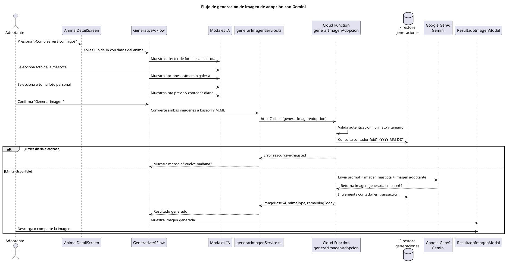
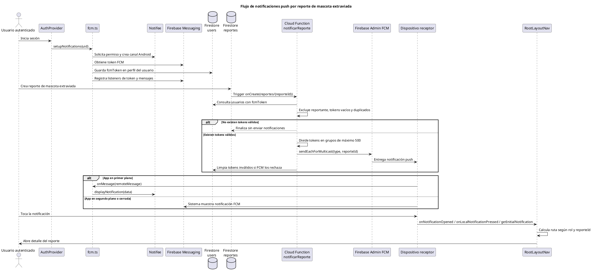

# Plan de trabajo — Sección 3.3.4 Fase 3: Construcción

> Documento de referencia autocontenido para retomar el desarrollo de la sección si se pierde el contexto de conversación. Contiene el plan completo, decisiones tomadas, materiales requeridos, diagramas PlantUML listos para insertar, y los recursos completos extraídos del documento de apoyo del usuario.

---

## 1. Contexto del proyecto

**Tesis:** APLICACIÓN MÓVIL PARA LA GESTIÓN DE ADOPCIONES Y REPORTE DE MASCOTAS EXTRAVIADAS CON GENERACIÓN DE IMÁGENES MEDIANTE IA EN LA FUNDACIÓN HUELLITAS

**Sección en desarrollo:** 3.3.4 Fase 3: Construcción (dentro del Capítulo III)

**Metodología:** RAD (Rapid Application Development)

**Estado de la app:** Construida con pantallas reales. Todas las funcionalidades operativas.

### Roles del sistema

| Rol | Propósito dentro del sistema |
| --- | --- |
| Adoptante | Consulta mascotas disponibles, solicita adopciones, reporta mascotas extraviadas, revisa sus solicitudes y utiliza el flujo de IA generativa |
| Personal | Registra y administra mascotas, revisa solicitudes, agenda entrevistas y consulta reportes |
| Superadmin | Administra cuentas del personal y activa o desactiva usuarios |

### Stack tecnológico real implementado

| Capa | Tecnología | Uso en la construcción |
| --- | --- | --- |
| Aplicación móvil | Expo 54, React Native 0.81, React 19 | Construcción de interfaces móviles y navegación |
| Lenguaje | TypeScript | Tipado de modelos, servicios, hooks y funciones |
| Navegación | Expo Router | Separación de rutas por rol: adoptante, personal, superadmin y autenticación |
| Formularios | React Hook Form + Yup | Captura y validación de datos en formularios |
| Backend | Firebase Auth, Firestore, Storage, Cloud Functions | Autenticación, base de datos, imágenes y lógica serverless |
| Notificaciones | Firebase Cloud Messaging + Notifee | Registro de token FCM, recepción y visualización de notificaciones push |
| Mapas y ubicación | react-native-maps, expo-location | Selección y visualización de ubicación en reportes |
| IA generativa | SDK `@google/genai` con modelo `gemini-2.5-flash-image` | Generación de imagen de vista previa de adopción |
| Plataforma | Solo Android | Delimitación documentada en Fase 2 |

---

## 2. Decisiones metodológicas tomadas

1. **Iteraciones RAD:** No se documentan iteraciones específicas ni cambios tras retroalimentación. El PDF de referencia de otra tesis tampoco las detalla, así que el enfoque queda en el resultado técnico construido, no en el proceso iterativo.

2. **Profundidad de capturas:** Las capturas de código solo se incluyen cuando ilustren una decisión técnica relevante (ejemplo: snippet del proxy de Gemini, snippet de reglas de Firestore). El resto se describe en prosa. Esto evita convertir la tesis en un manual de implementación.

3. **Capturas de pantalla de la app:** Se incluyen como evidencia de la construcción en cada módulo funcional.

4. **Ubicación de RNF-03 (Privacidad):** Confirmada Opción A. Sub-sección propia después de Autenticación, para dar visibilidad explícita al cumplimiento del requisito no funcional.

5. **Jerarquía de títulos en LaTeX:**
   - `3.3.4 Fase 3: Construcción` → `\subsection{}`
   - Apartados internos → `\subsubsection*{}` (sin numerar, estilo del PDF de referencia adaptado al formato académico)

6. **Numeración de figuras:** Manejada por LaTeX automáticamente. Se usan `\label{}` y `\ref{}` para referencias cruzadas. No se asignan números manuales.

---

## 3. Reglas de redacción que aplican

- Usa La skill `redaccion-academica`
- Citas en formato IEEE: `\cite{refN}`
- Todo el contenido en LaTeX válido

---

## 4. Estructura completa de la sección 3.3.4

### Párrafo introductorio (ya redactado)

Conecta con la Fase 2, establece el orden de presentación de cimiento a producto, menciona los tres módulos. Referencia la Figura de arquitectura del sistema (`fig:arquitectura-sistema`).

---

### Subsección 1 — Configuración del entorno y servicios en la nube ✅ COMPLETADA

**Cubre:** Creación del proyecto Firebase, plan Blaze, región `southamerica-east1`, servicios habilitados (Auth, Firestore, Storage, Functions, Messaging), registro de la app Android con package `com.fundacionhuellitas.app`, habilitación de Maps SDK y API de Gemini, separación de claves entre `.env` del cliente y `functions/.env`.

**Figura incluida:** `fig:firebase-console` (panel del console)

**Estado:** Entregada en LaTeX.

---

### Subsección 2 — Estructura del proyecto y arquitectura del cliente

**Cubre:**
- Estructura real de carpetas del proyecto (ver bloque de referencia abajo)
- Justificación de la arquitectura modular por capas (NO Clean Architecture; decisión explícita del proyecto)
- Sistema de tema unificado: `colors.ts`, `spacing.ts`, `typography.ts`, `animations.ts`
- Soporte para reducción de movimiento (`useReducedMotion()`)

**Estructura real construida (referencia para el texto):**

```text
app/
  (auth)/              Rutas de inicio de sesión y registro
  (adoptante)/         Pantallas del usuario adoptante
  (personal)/          Pantallas del personal de la fundación
  (superadmin)/        Pantallas administrativas

src/
  modules/
    adopcion/          Lógica de mascotas, solicitudes y entrevistas
    mascotas/          Lógica de reportes de mascotas extraviadas
    ia-generativa/     Flujo de generación de imágenes con IA
    superadmin/        Gestión de usuarios del personal
  shared/              Componentes, hooks, servicios Firebase y tipos comunes
  theme/               Colores, espaciado, tipografía y animaciones

functions/
  src/
    gemini.ts          Función callable para generación de imágenes
    notifications.ts   Funciones de notificación FCM
    users.ts           Funciones de gestión de personal
    eliminarCuenta.ts  Función para eliminación de cuenta adoptante
```

**Material requerido del usuario:**
- Captura del explorador de archivos del proyecto (VS Code o similar) mostrando `app/`, `src/` con sus módulos y `functions/src/` desplegados a un nivel

**Figura sugerida:** captura de la estructura de carpetas

**Diagrama opcional:** ninguno necesario; la captura es suficiente

---

### Subsección 3 — Modelo de datos en Firestore

**Cubre:**
- Justificación del modelo documental NoSQL para este dominio
- Colecciones implementadas:

| Colección | Descripción |
| --- | --- |
| `users` | Perfiles de usuario, rol, estado activo, teléfono, foto, token FCM y constancia del consentimiento de privacidad |
| `userPhones` | Índice auxiliar para evitar duplicidad de números telefónicos |
| `animales` | Mascotas registradas por el personal, con datos de salud, fotos y estado |
| `solicitudes` | Solicitudes de adopción creadas por adoptantes |
| `entrevistas` | Entrevistas agendadas y actualizadas por el personal |
| `reportes` | Reportes de mascotas extraviadas con ubicación, fotos y estado |
| `generaciones` | Contador diario de imágenes generadas con IA por usuario |

Los modelos principales están tipados en `src/shared/types/models.ts`.

**Material requerido del usuario:** ninguno (el modelo se describe en prosa y diagrama)

**Diagrama recomendado:** Diagrama de colecciones y relaciones lógicas en Mermaid (lo genero yo)

---

### Subsección 4 — Autenticación y autorización

**Cubre:**
- Firebase Auth con email/password
- Modelo de roles en Firestore: `superadmin`, `personal`, `adoptante`
- Reglas de seguridad declarativas como mecanismo de autorización (reemplaza AuthGuards/JWT del enfoque tradicional)
- Validación del campo `activo` antes de permitir acceso
- `RoleGuard.tsx` en el cliente como protección de rutas

**Archivos representativos:**
- `app/_layout.tsx`: controla la redirección global según autenticación y rol
- `src/shared/hooks/useAuth.tsx`: centraliza sesión, perfil, registro, cierre de sesión, actualización de perfil y token FCM
- `src/shared/components/RoleGuard.tsx`: protege pantallas según roles permitidos
- `src/shared/services/firebase/auth.ts`: integra Auth, Firestore y Cloud Functions
- `firestore.rules`
- `storage.rules`

**Medidas de seguridad implementadas:**
- Acceso autenticado obligatorio para leer información principal
- Control de permisos por rol
- Validación de usuario activo antes de permitir acceso
- Escritura de animales limitada al personal
- Gestión de personal limitada al superadmin
- Actualización de solicitudes limitada al personal
- Resolución de reportes limitada al usuario creador
- Escritura directa de la colección `generaciones` bloqueada desde el cliente

**Figura sugerida:** snippet de reglas de Firestore para una colección crítica (ejemplo: `solicitudes`)

---

### Subsección 5 — Privacidad, consentimiento y supresión de datos (RNF-03)

**Cubre:**
- Política de privacidad accesible desde la app (`app/(auth)/privacy.tsx`)
- Consentimiento informado obligatorio en el registro (checkbox)
- Modal de finalidad del tratamiento de datos
- Centralización de la versión de política y finalidades en `src/shared/constants/privacy.ts`
- Persistencia del consentimiento: `consentimientoPrivacidad`, `consentimientoPrivacidadVersion`, `consentimientoPrivacidadAceptadoEn`
- Supresión de datos desde el perfil del adoptante (Cloud Function `eliminarCuenta.ts`)

**Finalidades del tratamiento de datos (lo que el adoptante acepta):** administración de cuenta, gestión de adopciones, reportes de mascotas, contacto necesario, notificaciones y control de acceso por rol.

**Archivos representativos:**
- `app/(auth)/privacy.tsx`
- `app/(auth)/register.tsx`
- `src/shared/constants/privacy.ts`
- `src/shared/schemas/registerSchema.ts`
- `src/shared/services/firebase/auth.ts`
- `src/shared/hooks/useAuth.tsx`

**Material requerido del usuario:** captura de la pantalla de política de privacidad o del modal de consentimiento (1 captura)

---

### Subsección 6 — Almacenamiento de archivos en Firebase Storage

**Cubre:**
- Estructura de carpetas:
  - `/animales/{animalId}/{imageId}` (agrupado por animal)
  - `/solicitudes/{solicitudId}/{imageId}`
  - `/reportes/{reporteId}/{imageId}`
- Reglas de Storage por tipo de recurso
- Flujo de subida desde el cliente: image picker → Storage → URL persistida en Firestore

**Material requerido del usuario:** ninguno

---

### Subsección 7 — Cloud Functions

**Cubre las cuatro funciones implementadas:**

1. `users.ts` — Gestión de cuentas del personal (crear/desactivar/reactivar). Requiere Admin SDK.
2. `notifications.ts` — Trigger `onCreate` en `reportes`. Envía notificación push a usuarios con `fcmToken` válido, excluyendo al reportante. **Sin filtro geolocalizado** (cambio respecto al plan original). Divide tokens en lotes de hasta 500. Limpia tokens inválidos.
3. `gemini.ts` — Proxy autenticado a Google GenAI. Valida formato y tamaño, controla rate limit en transacción.
4. `eliminarCuenta.ts` — Eliminación de cuenta de adoptante con limpieza de datos asociados.

**Justificación común:** por qué cada función vive en el servidor y no en el cliente (seguridad de claves, validación de cuotas, operaciones privilegiadas).

**Material requerido del usuario:** ninguno (snippet se redacta en el documento)

**Figura sugerida:** snippet relevante del proxy de Gemini (la función técnicamente más interesante)

---

### Subsección 8 — Enrutamiento por rol con expo-router

**Cubre:**
- Route Groups: `(auth)`, `(adoptante)`, `(personal)`, `(superadmin)`
- AuthProvider y `useAuth.tsx` como fuente de verdad
- Redirección dinámica según rol leído de Firestore
- Manejo de estado de carga durante la resolución de autenticación

**Material requerido del usuario:** ninguno

**Diagrama recomendado:** flujo de autenticación y redirección por rol en Mermaid (lo genero yo)

---

### Subsección 9 — Módulo de adopción

**Cubre:**
- Pantallas del adoptante: catálogo, detalle, formulario de solicitud, mis solicitudes
- Pantallas del personal: gestión de animales (registro/edición), gestión de solicitudes, agendamiento de entrevistas, registro de resultado
- Validación con React Hook Form + Yup
- Pre-llenado de la ubicación del animal con la dirección de la fundación
- Confirmación de entrega que actualiza el estado del animal a `adoptado`
- Campo `desparasitado` en el formulario de animales (adicional al plan original)

**Funcionalidades construidas:**
- Catálogo de animales disponibles con filtros
- Detalle de mascota con imágenes y datos principales
- Registro y edición de animales por parte del personal
- Solicitud de adopción con imágenes obligatorias
- Seguimiento de solicitudes por parte del adoptante
- Gestión de solicitudes por parte del personal
- Programación y actualización de entrevistas
- Confirmación de entrega, actualizando el estado del animal a `adoptado`

**Archivos representativos:**
- `src/modules/adopcion/services/animalesService.ts`
- `src/modules/adopcion/services/solicitudesService.ts`
- `src/modules/adopcion/services/entrevistasService.ts`
- `src/modules/adopcion/hooks/useAnimales.ts`
- `src/modules/adopcion/hooks/useSolicitudes.ts`
- `src/modules/adopcion/components/AnimalRegistrationForm.tsx`
- `src/modules/adopcion/components/SolicitudCard.tsx`
- `src/modules/adopcion/schemas/animalSchema.ts`
- `src/modules/adopcion/schemas/solicitudSchema.ts`

**Material requerido del usuario:** 4 capturas reales:
- Catálogo del adoptante con filtros visibles
- Detalle del animal
- Formulario de solicitud de adopción
- Pantalla de gestión de animales del personal

---

### Subsección 10 — Módulo de mascotas extraviadas y notificaciones push

**Cubre el módulo de reportes:**
- Formulario de reporte con campos validados y selector de ubicación en mapa
- Lista de reportes activos con búsqueda
- Mapa con marcadores de reportes activos
- Detalle del reporte con galería y botón de WhatsApp (prefijo Ecuador `593`)
- Marcado como resuelto solo por el creador
- Límite de un reporte cada 14 días por usuario
- Campo `sexo` en el reporte para concordancia gramatical en notificaciones

**Cubre el subsistema de notificaciones push (integrado al final del módulo):**
- Registro de token FCM en el perfil del usuario
- Limpieza del token al cerrar sesión
- Notifee para visualización en primer plano + canal Android
- Cloud Function `notifications.ts` enviando a todos los usuarios con token válido (sin geolocalización)
- Eliminación de tokens inválidos detectados por FCM
- Apertura del detalle al tocar la notificación

**Archivos representativos del módulo de reportes:**
- `src/modules/mascotas/services/reportesService.ts`
- `src/modules/mascotas/hooks/useReportes.ts`
- `src/modules/mascotas/components/ReporteForm.tsx`
- `src/modules/mascotas/components/ReportesList.tsx`
- `src/modules/mascotas/components/ReporteDetail.tsx`
- `src/modules/mascotas/components/MapaReportes.tsx`
- `src/modules/mascotas/schemas/reporteSchema.ts`

**Archivos representativos de notificaciones:**
- `src/shared/services/notifications/fcm.ts`
- `src/shared/hooks/useAuth.tsx`
- `app/_layout.tsx`
- `functions/src/notifications.ts`

**Material requerido del usuario:** 3 capturas reales:
- Formulario de reporte
- Mapa con marcadores
- Detalle del reporte
- Muestra de la notificacion push

**Diagrama:** integrar el PlantUML de notificaciones push (incluido completo en la sección 7 de este documento).

---

### Subsección 11 — Módulo de IA generativa

**Cubre:**
- Flujo dentro de la pantalla de detalle del animal (no es pantalla separada)
- Secuencia de modales: selector de foto del animal → selector de foto del usuario → preview → resultado
- SDK `@google/genai` con modelo `gemini-2.5-flash-image`
- Cloud Function recibe: imágenes en base64, MIME types, nombre del animal
- Rate limit de 3 generaciones por usuario por día
- Contador con zona horaria `America/Guayaquil`
- Cliente solo lee el contador. La escritura está bloqueada por reglas de Firestore. La Cloud Function incrementa en transacción.
- Descarga bajo acción explícita del usuario (solicita permiso de galería en ese momento, no automáticamente)

**Flujo construido (referencia):**
1. El adoptante entra al detalle de una mascota
2. Selecciona una foto de la mascota
3. Selecciona o toma una foto personal
4. Revisa la vista previa de ambas imágenes
5. Solicita la generación de imagen
6. La Cloud Function llama a Google GenAI
7. La app muestra el resultado y permite compartirlo o guardarlo

**Controles implementados:**
- Límite de tres generaciones por usuario al día
- Validación de formatos de imagen
- Límite de tamaño de imágenes enviadas
- Generación del contador diario usando zona horaria `America/Guayaquil`
- Registro del uso diario en la colección `generaciones`

**Prompt usado en la Cloud Function (incluir literalmente en el documento):**

```text
Create a warm, realistic vertical portrait for an animal adoption preview.
Use the pet from the first image as {nombreMascota}.
Use the person from the second image as the adopter.
Compose them together in a cozy home, with natural soft light, emotional but realistic.
Preserve the pet's recognizable traits and avoid adding text, logos, UI elements, or watermarks.
```

`{nombreMascota}` se reemplaza por el nombre real del animal. Si no existe, se usa `la mascota`.

**Archivos representativos:**
- `src/modules/ia-generativa/components/GenerativeAIFlow.tsx`
- `src/modules/ia-generativa/components/FotoAnimalSelectorModal.tsx`
- `src/modules/ia-generativa/components/FotoUsuarioPickerSheet.tsx`
- `src/modules/ia-generativa/components/PreviewGeneracionSheet.tsx`
- `src/modules/ia-generativa/components/ResultadoImagenModal.tsx`
- `src/modules/ia-generativa/services/generarImagenService.ts`
- `functions/src/gemini.ts`

**Material requerido del usuario:** 2 capturas reales:
- Modal de selección de foto del animal
- Modal de resultado generado

**Diagrama:** integrar el PlantUML de generación de imagen con Gemini (incluido completo en la sección 7 de este documento).

---

### Subsección 12 — Módulo superadmin

**Cubre (alcance ampliado respecto al plan original):**
- Crear cuentas del personal
- Editar nombre, correo, teléfono y foto de perfil
- Desactivar usuarios del personal
- Reactivar usuarios desactivados
- Probar el envío de notificaciones (función auxiliar)
- Validación de que solo un superadmin activo puede ejecutar estas acciones (en Cloud Function)

**Archivos representativos:**
- `src/modules/superadmin/screens/GestionUsuariosScreen.tsx`
- `src/modules/superadmin/services/personalService.ts`
- `src/modules/superadmin/hooks/usePersonalUsers.ts`
- `src/modules/superadmin/schemas/personalSchema.ts`
- `functions/src/users.ts`

**Material requerido del usuario:** 1 captura real:
- Pantalla de gestión de usuarios del superadmin

---

## 5. Cierre de la sección 3.3.4

Tras la subsección 12, considerar un párrafo de cierre breve (3 a 5 oraciones) que sintetice el resultado de la fase de construcción y enlace con la Fase 4 (Implementación, sección 3.3.5). No repetir lo ya dicho. Foco en la integración del conjunto y la transición al despliegue.

---

## 6. Materiales que el usuario ya proporcionó

- Captura del Firebase Console con servicios habilitados → usada en subsección 1
- Documento Markdown completo con la construcción real del proyecto y dos diagramas PlantUML (incluidos en sección 7 de este documento)
- Plan de implementación original (referencia)
- PDF parcial de tesis de referencia con la sección 3.3.4 de otro proyecto (referencia de profundidad y formato, no de contenido)
- Confirmación de región: `southamerica-east1`
- Confirmación de package: `com.fundacionhuellitas.app`

---

## 7. Recursos completos extraídos del documento de apoyo

### 7.1 Diagrama de arquitectura general (Mermaid)



### 7.2 Diagrama de secuencia: Flujo de generación de imagen con Gemini (PlantUML)

Insertar en la subsección 11 (IA generativa).



### 7.3 Diagrama de secuencia: Flujo de notificaciones push (PlantUML)

Insertar en la subsección 10 (mascotas extraviadas y notificaciones).



### 7.4 Variables de entorno

| Variable | Ubicación | Propósito |
| --- | --- | --- |
| `GOOGLE_MAPS_API_KEY` | `.env` | Uso de mapas y búsqueda de lugares |
| `CLOUD_FUNCTIONS_URL` | `.env` | URL base para funciones HTTP si aplica |
| `GEMINI_API_KEY` | `functions/.env` | Acceso al servicio de generación de imágenes |

### 7.5 Comandos de construcción y verificación

Cliente móvil:

```powershell
npm install
npm start
npm run android
npm run lint
npx tsc --noEmit
```

Cloud Functions:

```powershell
cd functions
npm install
npm run build
npm run lint
npm run deploy
```

Despliegue Firebase:

```powershell
firebase deploy --only firestore:rules
firebase deploy --only storage
firebase deploy --only functions
```

### 7.6 Validación de datos por formulario

| Formulario | Validaciones aplicadas |
| --- | --- |
| Registro e inicio de sesión | Correo válido, contraseña mínima, confirmación y aceptación obligatoria de la política de privacidad |
| Registro de animales | Especie, sexo, edad flexible, estado de salud, vacunas, esterilización, desparasitación y máximo cinco fotos |
| Solicitud de adopción | Datos personales, fotografías obligatorias, ingresos y al menos un teléfono |
| Reporte de mascota | Especie, sexo, descripción, ubicación, teléfono de diez dígitos y máximo tres fotos |
| Personal | Nombre, correo, contraseña temporal y teléfono opcional |

### 7.7 Elementos UX implementados

- Navegación inferior diferenciada por rol
- Tarjetas para mascotas, solicitudes y reportes
- Estados de carga, vacío y error
- Formularios con mensajes de error inline
- Filtros y búsqueda para mejorar la localización de información
- Mapas para reportes de mascotas extraviadas
- Modales y hojas inferiores para el flujo de IA generativa
- Galerías de imágenes en detalles
- Microinteracciones y animaciones suaves con soporte para reducción de movimiento

---

## 8. Cambios respecto al plan de implementación original

| Punto del plan | Implementación final |
|---|---|
| Notificaciones geolocalizadas con radio configurable | Notificaciones a todos los usuarios con `fcmToken` válido, sin filtro de cercanía |
| Reporte sin campo `sexo` | Reporte incluye `sexo` para construir mensajes con concordancia gramatical |
| Envío push básico | Manejo de foreground con Notifee, canal Android, deduplicación de tokens, limpieza de tokens inválidos y apertura del detalle al tocar la notificación |
| Proxy Gemini con `axios` a Imagen 3 | SDK `@google/genai` con modelo `gemini-2.5-flash-image` |
| Request con solo dos imágenes en base64 | Request incluye `userMimeType`, `animalMimeType` y `animalName` |
| Cliente incrementa contador de generaciones | Cliente solo lee. Cloud Function incrementa en transacción. Reglas bloquean escritura desde cliente |
| Descarga automática del resultado | Descarga bajo acción explícita del usuario, con permiso de galería solicitado en ese momento |
| Tres Cloud Functions | Cuatro: agregar `eliminarCuenta.ts` |
| Sin política de privacidad | RNF-03 implementado: política, consentimiento obligatorio, modal de finalidad, persistencia del consentimiento |
| Superadmin: crear/desactivar | Superadmin: crear/editar/desactivar/reactivar/probar notificaciones |
| Storage de animales en ruta plana | Agrupado bajo `animales/{animalId}/{imageId}` |

---

## 9. Próximo paso

Subsección 2 — Estructura del proyecto y arquitectura del cliente.

Pendiente: el usuario debe enviar captura del explorador de archivos mostrando `app/`, `src/` con sus módulos, y `functions/src/` desplegados.